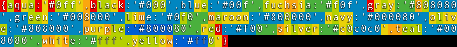
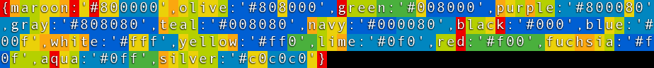

# Dict Tempering

**Change properties order for better GZIPpability. Works with JSON/JSON5 objects (dicts) and arrays and arbitrary newline separated strings.**

## Usage

`dict-tempering` is offered as a NodeJS CLI program that you can use with `npx` or install locally.

It gets its input via `stdin` and returns the result in `stdout`.

`--type` parameter specifies the input/output format. It can handle JSON & JSON5 objects (dictionaries) and arrays as well as any newline separated text

```sh
<some-unordered-array.json npx dict-tempering --type=json >reshuffled-array.json
```

```sh
<some-object.json5 npx dict-tempering >reshuffled-object.json5
```

```sh
<newline-separated.txt npx dict-tempering --type=newline >reshuffled.txt
```

## Why?

Quite often there are dictionaries or sets where the order of properties it not important. For example, color names:

```json5
{
    aqua: '#0ff',
    black: '#000',
    blue: '#00f',
    fuchsia: '#f0f',
    gray: '#808080',
    green: '#008000',
    lime: '#0f0',
    maroon: '#800000',
    navy: '#000080',
    olive: '#808000',
    purple: '#800080',
    red: '#f00',
    silver: '#c0c0c0',
    teal: '#008080',
    white: '#fff',
    yellow: '#ff0'
}
```

Ultimately, this code will be minified and served being GZIPped. 154 bytes .min.gz



You know the order is not important, but the GZIP/Brotli compressor doesn't know that. Let's help it and change the order of properies. Now it's 145 bytes .min.gz



9 bytes (or 6%) size reduction out of thin air. It's not too much, but it's for free!

`dict-tempering` does just that: It shuffles the movable chunks around so the entire string is compressed better.

## Is it worth it?

`dict-tempering` is most certainly doesn't fit for bundling (ex. a Webpack plugin). Unless you want to make your compilation or bundling process few minutes longer and save a dozen of bytes in exchange.

But it would help you in [JS code golf](https://jsgolf.club/) where every byte counts.

Or you can reshuffle properties in the source code once and [get a size recution forever](https://github.com/tradingview/lightweight-charts/commit/13ab1c6a76de9e35ffdc465afb159176d935c88f). _In fact, this entire project started as a makeshift script for this commit._

## Is it fast?

No. It's very slow.

In fact, its time complexity is somehwere near `O(n**3)` where `n` is the count of chunks. But the bruteforce would take a factorial `O(n!)` time, which is much, much longer!

## Does this tool produce the best shuffle possible?

No. Maybe. I'm not sure.

But it's good enough.

## I need the same but for CBOR, BSON, [insert your own], ...

The code is written with the extension ability in mind. All you need is to create a subclass and to implement `_split()` and `_assemble()` methods that fits your needs.

Please refer to the source code and TypeScript typings.
